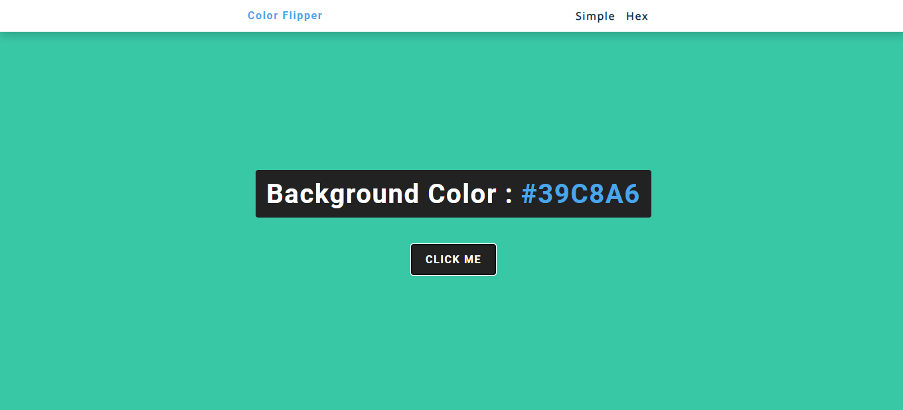

# Random Hex Color Generator

This is a <a href="https://random-hex-color-generator-2504.netlify.app/">Random Hex Color Generator</a> which processes out a random Hex value and changes the background color to it.

When you click on the "Click Me" button, with the power of JavaScript, a random Hex Value is generated and the background of the website is changed to the same color.

After going to the page and clicking the "Click Me" button, you will see that the colours are generated from a specific set. To generate random colours and hex values, click on the <strong>Hex</strong> option on the top right of the page and you will land at the page in which the random hex values will be generated.

